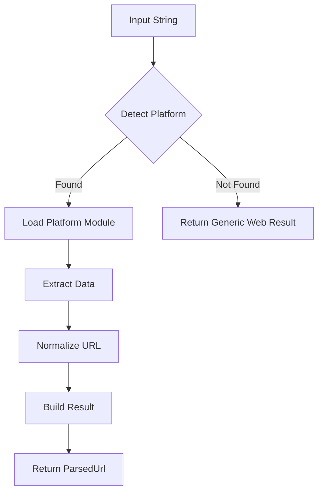

# Platform Parser Architecture

## Overview

The Platform Parser is a modular system designed to parse, validate, and extract information from social media URLs and usernames. The architecture prioritizes scalability, maintainability, and platform-specific customization while keeping each platform's implementation in a single, self-contained file.

## Directory Structure

```
src/utils/parse/
├── platforms/                    # Platform-specific modules (one file per platform)
│   ├── instagram.ts             # Instagram parser module
│   ├── youtube.ts               # YouTube parser module
│   ├── tiktok.ts                # TikTok parser module
│   ├── twitter.ts               # X/Twitter parser module
│   ├── facebook.ts              # Facebook parser module
│   ├── spotify.ts               # Spotify parser module
│   ├── snapchat.ts              # Snapchat parser module
│   ├── linkedin.ts              # LinkedIn parser module
│   ├── pinterest.ts             # Pinterest parser module
│   ├── telegram.ts              # Telegram parser module
│   ├── discord.ts               # Discord parser module
│   ├── reddit.ts                # Reddit parser module
│   ├── twitch.ts                # Twitch parser module
│   ├── patreon.ts               # Patreon parser module
│   ├── soundcloud.ts            # SoundCloud parser module
│   └── index.ts                 # Platform exports and registry
├── core/
│   ├── parser.ts                # Core parsing orchestrator
│   ├── detector.ts              # Platform detection logic
│   ├── types.ts                 # Shared TypeScript types
│   └── constants.ts             # Shared constants
├── utils/
│   ├── url.ts                   # URL manipulation utilities
│   ├── validation.ts            # Common validation functions
│   └── normalization.ts         # URL normalization utilities
├── index.ts                     # Public API exports
├── ARCHITECTURE.md              # This file
└── README.md                    # User documentation
```

## File Organization Principles

### Single File Per Platform
Each platform's entire implementation lives in a single TypeScript file. This approach:
- **Maintains cohesion**: All platform logic is co-located
- **Simplifies navigation**: One file = one platform
- **Reduces complexity**: No circular dependencies or complex imports
- **Improves discoverability**: Easy to find and understand platform logic

### When to Consider Splitting
Only split a platform file when:
- File exceeds 500+ lines and has clear separation of concerns
- Multiple developers frequently conflict on the same file
- Platform requires significant external integrations (API clients, etc.)

## Core Concepts

### 1. Platform Module

Each platform is a self-contained module that exports a `PlatformModule` object:

```typescript
interface PlatformModule {
  // Identity
  id: Platforms
  name: string
  color?: string
  
  // Domains & Detection
  domains: string[]
  mobileSubdomains?: string[]
  shortDomains?: string[]
  
  // Pattern Collection
  patterns: {
    profile: RegExp
    handle: RegExp
    content?: {
      post?: RegExp
      video?: RegExp
      story?: RegExp
      [key: string]: RegExp | undefined
    }
  }
  
  // Core Methods
  detect(url: string): boolean
  extract(url: string, result: ParsedUrl): void
  validateHandle(handle: string): boolean
  
  // URL Builders
  buildProfileUrl(username: string): string
  buildContentUrl?(contentType: string, id: string): string
  
  // Normalization
  normalizeUrl(url: string): string
  
  // Platform-Specific Features (optional)
  extractTimestamp?(url: string): number | null
  generateEmbedUrl?(contentId: string, options?: any): string
  resolveShortUrl?(shortUrl: string): Promise<string>
}
```

### 2. Parser Flow



### 3. Result Structure

```typescript
interface ParsedUrl {
  // Validation
  isValid: boolean
  
  // URLs
  originalUrl: string
  normalizedUrl: string
  canonicalUrl?: string
  
  // Platform Info
  platform: Platforms | null
  platformName?: string
  
  // User Data
  username?: string
  userId?: string
  
  // Content Data
  ids: {
    postId?: string
    videoId?: string
    storyId?: string
    [key: string]: string | undefined
  }
  
  // Metadata
  metadata: {
    isProfile?: boolean
    isPost?: boolean
    isVideo?: boolean
    isStory?: boolean
    isEmbed?: boolean
    contentType?: string
    [key: string]: any
  }
  
  // Embed Data
  embedData?: {
    platform: EmbedPlatform
    type: EmbedType
    contentId: string
    embedUrl?: string
    options?: any
  }
}
```

## Implementation Examples

### Basic Platform Module (Instagram)

```typescript
// platforms/instagram.ts
import { PlatformModule, Platforms, ParsedUrl } from '../core/types'

export const instagram: PlatformModule = {
  id: Platforms.Instagram,
  name: 'Instagram',
  color: '#E1306C',
  
  domains: ['instagram.com', 'instagr.am'],
  mobileSubdomains: ['m', 'mobile'],
  
  patterns: {
    profile: /^(?:https?:\/\/)?(?:www\.)?instagram\.com\/([a-zA-Z0-9_.]+)/i,
    handle: /^[\w](?!.*?\.{2})[\w.]{0,28}[\w]$/i,
    content: {
      post: /instagram\.com\/p\/([A-Za-z0-9_-]+)/i,
      reel: /instagram\.com\/reels?\/([A-Za-z0-9_-]+)/i,
      story: /instagram\.com\/stories\/([a-zA-Z0-9_.]+)\/(\d+)/i,
      tv: /instagram\.com\/tv\/([A-Za-z0-9_-]+)/i,
    }
  },
  
  detect(url: string): boolean {
    return this.domains.some(domain => 
      url.toLowerCase().includes(domain)
    )
  },
  
  extract(url: string, result: ParsedUrl): void {
    // Profile detection
    const profileMatch = this.patterns.profile.exec(url)
    if (profileMatch && !url.includes('/p/') && !url.includes('/reel')) {
      result.username = profileMatch[1]
      result.metadata.isProfile = true
      result.metadata.contentType = 'profile'
      return
    }
    
    // Content detection
    if (this.patterns.content) {
      for (const [type, pattern] of Object.entries(this.patterns.content)) {
        if (!pattern) continue
        
        const match = pattern.exec(url)
        if (match) {
          result.ids[`${type}Id`] = match[1]
          result.metadata[`is${type.charAt(0).toUpperCase() + type.slice(1)}`] = true
          result.metadata.contentType = type
          
          // Extract username if present
          const userMatch = this.patterns.profile.exec(url)
          if (userMatch) {
            result.username = userMatch[1]
          }
          break
        }
      }
    }
  },
  
  validateHandle(handle: string): boolean {
    return this.patterns.handle.test(handle)
  },
  
  buildProfileUrl(username: string): string {
    const cleanUsername = username.replace('@', '')
    return `https://instagram.com/${cleanUsername}`
  },
  
  buildContentUrl(contentType: string, id: string): string {
    const paths: Record<string, string> = {
      post: 'p',
      reel: 'reel',
      tv: 'tv',
    }
    const path = paths[contentType] || 'p'
    return `https://instagram.com/${path}/${id}`
  },
  
  normalizeUrl(url: string): string {
    // Remove Instagram-specific tracking parameters
    let normalized = url
      .replace(/[?&](igshid|utm_[^&]+|ig_[^&]+)=[^&]+/g, '')
      .replace(/\?$/, '')
    
    // Remove trailing slash
    normalized = normalized.replace(/\/$/, '')
    
    // Ensure HTTPS
    if (!normalized.startsWith('http')) {
      normalized = `https://${normalized}`
    }
    
    return normalized
  }
}
```

### Complex Platform Module (YouTube)

```typescript
// platforms/youtube.ts
export const youtube: PlatformModule = {
  id: Platforms.YouTube,
  name: 'YouTube',
  color: '#FF0000',
  
  domains: ['youtube.com', 'youtu.be', 'youtube-nocookie.com'],
  mobileSubdomains: ['m', 'mobile'],
  shortDomains: ['youtu.be'],
  
  patterns: {
    profile: /youtube\.com\/(?:c\/|channel\/|user\/|@)([a-zA-Z0-9_-]+)/i,
    handle: /^[a-zA-Z0-9][a-zA-Z0-9._-]{2,29}$/,
    content: {
      video: /(?:youtube\.com\/watch\?v=|youtu\.be\/)([a-zA-Z0-9_-]{11})/i,
      short: /youtube\.com\/shorts\/([a-zA-Z0-9_-]{11})/i,
      playlist: /youtube\.com\/playlist\?list=([a-zA-Z0-9_-]+)/i,
      live: /youtube\.com\/live\/([a-zA-Z0-9_-]{11})/i,
    }
  },
  
  // ... standard methods ...
  
  // YouTube-specific features
  extractTimestamp(url: string): number | null {
    const match = url.match(/[?&]t=(\d+)/)
    return match ? parseInt(match[1]) : null
  },
  
  generateEmbedUrl(contentId: string, options?: YouTubeEmbedOptions): string {
    const params = new URLSearchParams()
    
    if (options?.autoplay) params.set('autoplay', '1')
    if (options?.startTime) params.set('start', options.startTime.toString())
    if (options?.mute) params.set('mute', '1')
    if (options?.controls === false) params.set('controls', '0')
    
    const queryString = params.toString()
    return `https://www.youtube.com/embed/${contentId}${queryString ? `?${queryString}` : ''}`
  },
  
  async resolveShortUrl(shortUrl: string): Promise<string> {
    // In production, this would make an HTTP request
    // For now, extract video ID and build full URL
    const match = shortUrl.match(/youtu\.be\/([a-zA-Z0-9_-]{11})/)
    if (match) {
      return `https://youtube.com/watch?v=${match[1]}`
    }
    return shortUrl
  }
}
```

## Usage Examples

### Basic Usage

```typescript
import { parse } from '@/utils/parse'

// Parse a URL
const result = parse('https://instagram.com/username?utm_source=share')
console.log(result.username) // 'username'
console.log(result.platform) // Platforms.Instagram
console.log(result.normalizedUrl) // 'https://instagram.com/username'

// Validate a handle
const isValid = parse('@username', { platform: Platforms.Instagram, type: 'handle' })
console.log(isValid) // true
```

### Advanced Usage

```typescript
// Parse with options
const result = parse('youtu.be/dQw4w9WgXcQ?t=42', {
  resolveShortUrls: true,
  extractMetadata: true
})

console.log(result.normalizedUrl) // 'https://youtube.com/watch?v=dQw4w9WgXcQ'
console.log(result.metadata.timestamp) // 42
console.log(result.embedData?.embedUrl) // 'https://youtube.com/embed/dQw4w9WgXcQ?start=42'
```

## Adding a New Platform

### Step 1: Create Platform Module

```typescript
// platforms/newplatform/index.ts
export const newplatform: PlatformModule = {
  id: Platforms.NewPlatform,
  name: 'NewPlatform',
  domains: ['newplatform.com'],
  
  patterns: {
    profile: /newplatform\.com\/([a-zA-Z0-9_]+)/i,
    handle: /^[a-zA-Z0-9_]{3,20}$/,
  },
  
  // Implement required methods
  detect(url) { /* ... */ },
  extract(url, result) { /* ... */ },
  validateHandle(handle) { /* ... */ },
  buildProfileUrl(username) { /* ... */ },
  normalizeUrl(url) { /* ... */ },
}
```

### Step 2: Register Platform

```typescript
// platforms/index.ts
export { instagram } from './instagram'
export { youtube } from './youtube'
export { newplatform } from './newplatform' // Add this
```

### Step 3: Add Platform Enum

```typescript
// core/types.ts
export enum Platforms {
  Instagram = 0,
  YouTube = 2,
  NewPlatform = 99, // Add this
}
```

## Testing Strategy

### Unit Tests

Each platform module should have comprehensive tests:

```typescript
// platforms/instagram.test.ts
import { instagram } from './instagram'

describe('Instagram Parser', () => {
  describe('URL Detection', () => {
    test('detects standard URLs', () => {
      expect(instagram.detect('instagram.com/user')).toBe(true)
      expect(instagram.detect('m.instagram.com/user')).toBe(true)
    })
  })
  
  describe('Data Extraction', () => {
    test('extracts profile data', () => {
      const result = {} as ParsedUrl
      instagram.extract('instagram.com/johndoe', result)
      expect(result.username).toBe('johndoe')
      expect(result.metadata.isProfile).toBe(true)
    })
    
    test('handles query parameters', () => {
      const result = {} as ParsedUrl
      instagram.extract('instagram.com/user?hl=en&utm=test', result)
      expect(result.username).toBe('user')
    })
  })
})
```

### Integration Tests

```typescript
// core/parser.test.ts
describe('Parser Integration', () => {
  test('parses Instagram URL with all features', () => {
    const result = parse('https://instagram.com/p/ABC123?utm_source=test')
    
    expect(result).toMatchObject({
      isValid: true,
      platform: Platforms.Instagram,
      normalizedUrl: 'https://instagram.com/p/ABC123',
      ids: { postId: 'ABC123' },
      metadata: { isPost: true, contentType: 'post' }
    })
  })
})
```

### 3. Pattern Compilation

Pre-compile regex patterns:

```typescript
// Compile once at module load
const COMPILED_PATTERNS = new Map<string, RegExp>()

function getPattern(key: string, pattern: string): RegExp {
  if (!COMPILED_PATTERNS.has(key)) {
    COMPILED_PATTERNS.set(key, new RegExp(pattern, 'i'))
  }
  return COMPILED_PATTERNS.get(key)!
}
```

## Future Enhancements

### 1. Plugin System

Allow external platform modules:

```typescript
// registry/plugin-system.ts
class PlatformRegistry {
  registerPlugin(module: PlatformModule) {
    this.platforms.set(module.id, module)
  }
  
  loadFromDirectory(dir: string) {
    // Dynamically load all platform modules
  }
}
```

### 2. Configuration Files

Support JSON/YAML configuration:

```yaml
# platforms/instagram/config.yaml
id: Instagram
name: Instagram
domains:
  - instagram.com
  - instagr.am
patterns:
  profile: 'instagram\.com\/([a-zA-Z0-9_.]+)'
  post: 'instagram\.com\/p\/([A-Za-z0-9_-]+)'
```

### 3. AI-Powered Detection

Use machine learning for ambiguous URLs:

```typescript
interface MLPlatformDetector {
  predict(url: string): {
    platform: Platforms
    confidence: number
  }
}
```

## Maintenance Guidelines

### Regular Updates

1. **Monitor Platform Changes**: Platforms frequently update their URL structures
2. **Update Patterns**: Keep regex patterns current with platform changes
3. **Add New Features**: Support new content types as platforms add them

### Deprecation Strategy

When platforms change:

```typescript
// platforms/twitter.ts
export const twitter: PlatformModule = {
  id: Platforms.XPlatform,
  name: 'X',
  
  // Support both old and new domains
  domains: ['x.com', 'twitter.com'],
  
  // Normalize to new domain
  normalizeUrl(url: string): string {
    return url.replace('twitter.com', 'x.com')
  }
}
```

### Version Control

Consider versioning platform modules:

```typescript
interface VersionedPlatformModule extends PlatformModule {
  version: string
  changelog?: string[]
  deprecated?: boolean
  migrateTo?: Platforms
}
```

## Conclusion

This modular architecture provides:

- **Scalability**: Easy to add new platforms
- **Maintainability**: Each platform is isolated
- **Flexibility**: Platform-specific features
- **Performance**: Optimizable per platform
- **Testability**: Isolated unit tests
- **Type Safety**: Full TypeScript support

The system can grow from supporting a handful of platforms to hundreds without architectural changes.

## Complete Functionality List

### Core Parsing Functions

1. **URL Detection & Validation**
   - Detect if input is a valid URL
   - Identify platform from URL patterns
   - Validate URL structure and format
   - Handle mobile URLs (m.facebook.com, mobile.twitter.com)
   - Support international domains (.co.uk, .fr, etc.)

2. **Username/Handle Validation**
   - Validate username format per platform rules
   - Support @ prefix handling
   - Check character limits and allowed characters
   - Handle platform-specific username rules

3. **Content Type Detection**
   - Identify posts, videos, reels, stories
   - Detect profile/channel pages
   - Recognize playlists, albums, tracks
   - Identify live streams and events

4. **Data Extraction**
   - Extract usernames from URLs
   - Extract content IDs (post ID, video ID, etc.)
   - Parse timestamps from URLs
   - Extract hashtags and mentions
   - Get query parameters

5. **URL Normalization**
   - Remove tracking parameters (utm_*, fbclid, etc.)
   - Standardize URL format
   - Convert to HTTPS
   - Remove unnecessary query parameters
   - Handle trailing slashes

6. **URL Building**
   - Build profile URLs from usernames
   - Create content URLs from IDs
   - Generate canonical URLs
   - Construct API endpoints

### Platform-Specific Features

7. **Embed Support**
   - Generate embed URLs for supported platforms
   - Configure embed parameters (autoplay, mute, etc.)
   - Detect embeddable content
   - Provide embed metadata

8. **Short URL Resolution**
   - Detect shortened URLs (bit.ly, tinyurl, platform-specific)
   - Resolve to full URLs
   - Handle platform short domains (youtu.be, instagr.am)

9. **Content Metadata**
   - Identify content type (video, image, text)
   - Extract duration for videos
   - Get thumbnail URLs
   - Parse publish dates

10. **Platform Migration**
    - Handle platform rebranding (Twitter → X)
    - Support legacy URLs
    - Redirect old formats to new

### Advanced Features

11. **Batch Processing**
    - Parse multiple URLs efficiently
    - Validate URL lists
    - Extract data in bulk

12. **Error Handling**
    - Graceful failure with detailed errors
    - Provide correction suggestions
    - Handle malformed URLs
    - Support partial parsing

13. **Internationalization**
    - Support non-ASCII usernames
    - Handle RTL languages
    - Parse international URL formats
    - Support punycode domains

14. **Performance Optimization**
    - Cache detection results
    - Lazy load platform modules
    - Pre-compile regex patterns
    - Minimize parsing overhead

15. **Extensibility**
    - Plugin architecture for new platforms
    - Custom platform definitions
    - Override default behaviors
    - Add platform-specific features

### Utility Functions

16. **URL Manipulation**
    - Add/remove query parameters
    - Change protocols
    - Modify paths
    - Combine URL parts

17. **Validation Helpers**
    - Email validation
    - Phone number detection
    - Generic URL validation
    - Domain validation

18. **Text Processing**
    - Extract mentions (@username)
    - Extract hashtags (#tag)
    - Parse URLs from text
    - Clean and sanitize input

19. **Platform Detection**
    - Identify platform from domain
    - Detect platform from URL pattern
    - Guess platform from username format
    - Support ambiguous inputs

20. **Format Conversion**
    - Convert between URL formats
    - Transform mobile to desktop URLs
    - Generate shareable URLs
    - Create deep links

This comprehensive functionality set ensures the platform parser can handle virtually any social media URL or username parsing requirement while maintaining clean, maintainable code. 